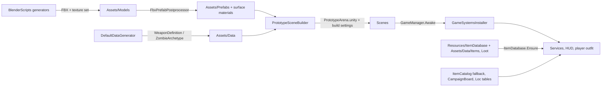
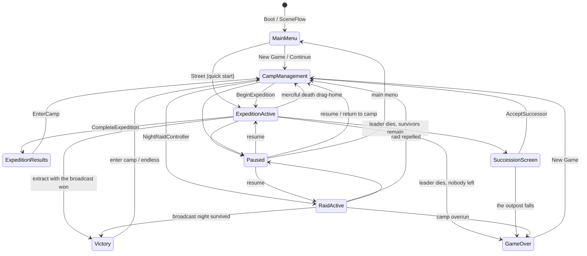

# Architecture

Outpost Zero is one runtime assembly (`OutpostZero`, `Assets/Scripts/OutpostZero.asmdef`), one editor assembly (`OutpostZero.Editor`), and two test assemblies (`OutpostZero.Tests.EditMode`, `OutpostZero.Tests.PlayMode`).

## Namespaces

Every folder under `Assets/Scripts` is one namespace.

| Namespace | Folder | Owns |
|---|---|---|
| `OutpostZero.Core` | `Core/` | `GameManager` and the game state machine, `GameSystemsInstaller`, `SettingsService`, `PlayerRegistry`, `GameplayFeedback` toasts, shared enums (`GameState`, `NoiseType`, `WeaponType`, `ItemCategory`), `WeaponDefinition` and `ZombieArchetype` assets, `Attach` and `Tick` helpers |
| `OutpostZero.Combat` | `Combat/` | `WeaponBase`, `FirearmWeapon`, `MeleeWeapon`, `BulletProjectile`, `HealthSystem`, `CombatEvents`, destructibles, barrels, throwables |
| `OutpostZero.AI` | `AI/` | `ZombieAI` state machine, `ZombieSpawner`, `ZombiePool`, `HordeDirector` tension, special attacks, voices |
| `OutpostZero.Sensory` | `Sensory/` | `NoiseManager`, `INoiseListener`, hearing falloff through walls, footstep noise |
| `OutpostZero.Player` | `Player/` | `PlayerController`, `PlayerInventory`, `SurvivalNeeds`, `StatusEffectController`, `ExpeditionInput`, `ControlBindings`, `PadBindings` |
| `OutpostZero.Items` | `Items/` | `ItemDatabase`, `ItemDefinition` / `AmmoDefinition` / `LootTableDefinition` assets, `ItemCatalog` fallback, loot tables, `LootContainer` |
| `OutpostZero.Expedition` | `Expedition/` | `ObjectiveTracker`, `ExtractionZone`, street doors, rescue followers |
| `OutpostZero.Colony` | `Colony/` | `SurvivorRoster`, `WorldClock`, `ColonyStorage`, `GridBuilder`, `CraftingBench`, `NightRaidController`, `FactionTrade`, camp modules, needs and morale |
| `OutpostZero.Graphics` | `Graphics/` | `DayNightCycle`, `WeatherController`, `PostFxRig`, `UrpMaterialPass`, `PerfBudget`, `LodGovernor`, `ImpactDecalPool`, `DistrictDressing` |
| `OutpostZero.Shell` | `Shell/` | `SaveSystem`, `AudioManager`, `WorldMapService` campaign, `TutorialDirector`, `CodexDirector`, `Loc` localization (English, Spanish), `SceneRoute`, `BootPlan`, `DevCheats`, district generators |
| `OutpostZero.UI` | `UI/` | `OutpostInterface` (UI Toolkit HUD, menus, camp board), `GameShellUI`, `SceneFlow` and `LoadCard` transitions, `BootLoader`, `DevPanel` |
| `OutpostZero.EditorTools` | `Editor/` | `PrototypeSceneBuilder`, `DefaultDataGenerator`, `FbxPrefabPostprocessor`, `SurvivorAnimatorBuilder`, `RendererFeatureSetup` |
| `OutpostZero.Utils` | `Utils/` | Small shared utilities |

Most gameplay rules live in small `static` classes with no Unity state (for example `DodgeClock`, `StreetLimp`, `CampaignBoard`, `NewGamePlan`). MonoBehaviours call them, and EditMode tests exercise them directly.

## Services and registries

**Services** are MonoBehaviour singletons with a static `Instance`. `GameSystemsInstaller.Install(scene)` attaches them all to the `GameManager` object, which is `DontDestroyOnLoad`, so they survive scene loads:

`SettingsService`, `AudioManager`, `SaveSystem`, `RunArchive`, `SurvivorRoster`, `WorldClock`, `ColonyStorage`, `GridBuilder`, `CraftingBench`, `NightRaidController`, `FactionTrade`, `ObjectiveTracker`, `DayNightCycle`, `WeatherController`, `PostFxRig`, `UrpMaterialPass`, `PerfBudget`, `LodGovernor`, `WorldMapService`, `TutorialDirector`, `CodexDirector`, `SceneFlow`, `DevPanel`, `CampServices`, `CampPopulation`, `DistrictDressing`.

The installer also outfits the player (`SurvivalNeeds`, `StatusEffectController`, `PlayerInteractor`, locomotion), and adds `HitFeedback`, `ImpactDecalPool`, `GameShellUI`, `OutpostInterface` and `ExpeditionCameraRig` to the main camera. The saved arena scene predates most of these components, so they are added when the scene loads.

Always reach a service through `Instance` with a null check (`SaveSystem.Instance?.Save()`), because EditMode tests and the Boot scene run without them.

**Registries** track scene objects that come and go. `PlayerRegistry.Current` is the active leader. `ZombiePool` rents and releases zombie bodies. `NoiseManager` keeps the listeners that hear each noise.

To add a component to an object only if it's missing, use `Attach.Ensure<T>(gameObject)`. Don't write `GetComponent<T>() ?? AddComponent<T>()`: Unity's fake null makes `??` skip the add.

## Data flow

Items are `ItemDefinition` / `AmmoDefinition` assets in `Assets/Data/Items` and loot tables are `LootTableDefinition` assets in `Assets/Data/Loot`, listed by `Assets/Resources/ItemDatabase.asset`. Each definition links its pipeline prefab (`worldPrefab`, spawned on drop) and its rendered icon (shown in the pack). `ItemDatabase.Get(id)` loads the database once and pushes its stats and tables into `ItemCatalog` and `LootTables`, whose code records are the fallback that keeps saves and pure tests independent of imported assets. **Tools > Outpost Zero > Sync Item Database** (also run by `DefaultDataGenerator`) creates definitions for new ids and fills in missing prefab and icon links. Districts, recipes and strings stay in code (`CampaignBoard`, `Localization`). Weapons and zombies come from `WeaponDefinition` and `ZombieArchetype` assets under `Assets/Data`, generated by `DefaultDataGenerator`.

## Scenes and flow

`Assets/Scenes/Boot.unity` is build index 0. `BootLoader` streams `PrototypeArena.unity` behind the loading card. When the arena loads, `GameManager.Awake` runs the installer and `SceneFlow` travels to the main menu. The menu, camp, expedition and results screens all run inside the arena as game states, and every change between them goes through `SceneFlow.Travel`, which plays the loading card. When the card lands, `SceneEntries` calls `OnExit` and then `OnEnter(FlowContext)` on each registered `ISceneEntry`. `GameManager` is one of them: a bare `Travel(step)` lets `FlowArrival` pick the state for that step (menu, camp or street). A caller that brings its own context, such as a new-game seed or a save slot, passes an arrival callback, and the hop is marked handled. `MenuBackdrop` is another entry, taking over the camera while the menu is up. Restart calls `GameManager.ReturnToBoot`, which resets the run and loads Boot again.

## Game state machine

`GameManager.SetState` is the only way to change state. It freezes time (`Time.timeScale = 0`) for Paused, SuccessionScreen, GameOver, MainMenu, ExpeditionResults and Victory, and it raises `OnGameStateChanged`.

## Event catalogue

| Event | Raised when | Main listeners |
|---|---|---|
| `GameManager.OnGameStateChanged(GameState)` | Any state change | UI, audio mix, music stems |
| `GameManager.OnZombiesKilledChanged(int)` | A kill is recorded or the run resets | `ObjectiveTracker`, HUD |
| `GameManager.OnScrapLootedChanged(int)` | Scrap picked up or reset | HUD |
| `CombatEvents.OnShotFired(Vector3, WeaponBase)` | A firearm fires | `AudioManager` |
| `CombatEvents.OnHit(Vector3 point, Vector3 normal, GameObject target)` | A shot or swing lands | `AudioManager`, `ImpactDecalPool`, hit feedback |
| `CombatEvents.OnKill(GameObject victim, GameObject killer)` | Something dies to an attack | `AudioManager`, kill feed |
| `NoiseManager.OnNoiseEmitted(Vector3, float radius, NoiseType)` | Any noise enters the world | captions, noise meter, raid odds |
| `HealthSystem.OnHealthChanged / OnDamaged / OnDeath` | Per damageable | HUD, zombie death, player death |
| `WeaponBase.OnAttackFired`, `FirearmWeapon.OnAmmoChanged / OnReloadStarted / OnReloadCompleted` | Per weapon | HUD, animation |
| `PlayerController.OnStaminaChanged / OnActiveWeaponChanged` | Leader stamina or weapon swap | HUD |
| `PlayerInventory.OnInventoryChanged`, `SurvivalNeeds.OnNeedsChanged` | Leader bag or needs | HUD, camp board |
| `HordeDirector.OnTensionStateChanged(TensionState)` | `Calm`, `BuildUp`, `Peak`, `Relax` | music, spawns |
| `ObjectiveTracker.OnObjectivesChanged` | Objective progress | HUD |
| `SurvivorRoster.OnRosterChanged`, `WorldClock.OnClockChanged`, `ColonyStorage.OnStorageChanged` | Colony changes | camp board |
| `SettingsService.OnChanged` | Any setting | audio, graphics, localization |
| `GameplayFeedback.OnToast(string)` | A one-line notice | HUD toast stack |
| `ZombiePool.OnReleased(GameObject)` | A zombie body returns to the pool | spawner |

## Saves

`SaveSystem` writes JSON with `JsonUtility` to `Application.persistentDataPath`, one file per slot (`slot_auto.json` for the autosave, `slot_0.json` and up for manual slots; see `SaveSlots`). A negative slot maps to the old single file `outpost-zero-save.json`. `SaveCodec` packs roster, storage, campaign, codex, weapon mods and street state into the schema.
